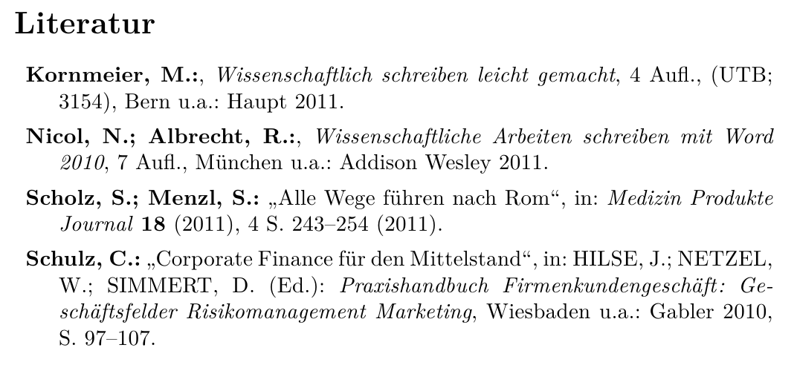

Examples
********

Example 1
=========

The following example is taken from a question posted at ``http://tex.stackexchange.com/questions/147675/bibtex-scientific-style-with-pages-at-the-end``, where the desired bibliography format is given as:

.. image:: _static/example1a.png
   :width: 50%

With Bibulous, we can easily provide templates that provide the formatting that the OP asks for:

.. literalinclude:: ../examples/example1.bst

so that if we use this template together with the following database file:

.. literalinclude:: ../examples/example1.bib

then we get the formatted result shown below

.. image:: _static/example1b.png
   :width: 60%

************************************************

Example 2
=========

The next example is taken from the bibliography style found in: Dimitri Mihalas and James Binney, _Galactic Astronomy: Structure and Kinematics_, 2nd ed. (W. H. Freeman, New York, 1981). A snapshot from the the book's bibliography looks like

.. image:: _static/example2a.png
   :width: 60%

To produce this style, we can define the following templates:

.. literalinclude:: ../examples/example2.bst

so that with the following database file:

.. literalinclude:: ../examples/example2.bib

we get the following formatted result

.. image:: _static/example2b.png
   :width: 60%

************************************************

Example 3
=========

The next example illustrates the style used by the Optical Society of America (OSA) for their journals. The following formatted bibliography

.. image:: _static/example3.png
   :width: 60%

is obtained using the template

.. literalinclude:: ../examples/example3.bst

and the database file

.. literalinclude:: ../examples/example3.bib

************************************************

Example 4
=========

The next example illustrates the style used by the society SPIE for their journals. The following formatted bibliography

.. image:: _static/example4.png
   :width: 60%

is obtained using the template

.. literalinclude:: ../examples/example4.bst

and the database file

.. literalinclude:: ../examples/example4.bib

************************************************

Example 5
=========

The following example is taken from a question posted at ``http://tex.stackexchange.com/questions/160737/bold-labels-and-more-with-custom-bibtex-bst-and-author-year``, where an answer to the original poster's question is given as

.. image:: _static/example5a.png
   :width: 60%

The answerer's database file 

.. literalinclude:: ../examples/example5.bib

makes use of separate formatting instructions for titles and subtitles, so that an appropriate style template is

.. literalinclude:: ../examples/example5.bst

producing the formatted result

************************************************

Example 6
=========

************************************************

Example ?
=========

This follows an online question posted at ``http://tex.stackexchange.com/questions/961/bibtex-style-that-groups-by-author``.
