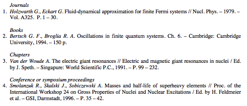

Examples
********

Example 1
=========

The following example is taken from a question posted at ``http://tex.stackexchange.com/questions/147675/bibtex-scientific-style-with-pages-at-the-end``. The OP asks:

    Where can I find bibtex style, which looks approximately like this? Somehow all styles (even ``science.bst``), which I find use ``format.vol.num.pages`` function, which put pages right after volume number. But the order I used to see and use is ``volNum-year-pages``. I can simply move the line ``format.date "year" output.check`` into ``format.vol.num.pages``, but 1. I am not sure whether this is correct (looks strange for me), 2. I don't know how to add the ``---`` sign in front.

With Bibulous, we can easily provide templates that provide the formatting that the OP asks for:

.. literalinclude:: ../examples/example1.bst

so that if we use this template together with the following database file:

.. literalinclude:: ../examples/example1.bib

then we get the formatted result shown below

.. image:: _static/example1b.png
   :width: 60%

************************************************

Example 2
=========

The next example is taken from the bibliography style found in: Dimitri Mihalas and James Binney, _Galactic Astronomy: Structure and Kinematics_, 2nd ed. (W. H. Freeman, New York, 1981). A snapshot from the the book's bibliography looks like

.. image:: _static/example2a.png
   :width: 50%

To produce this style, we can define the following templates:::

    TEMPLATES:
    article = <au> <year>. \textit{<journal>} \textbf{<volume>}:<pages>.
    book = [<au>|<ed.if_singular(editorlist, eds_msg1, eds_msg2)>|]. <year>. \textit{<title>}. (<address>: <publisher>).
    proceedings = book
    phdthesis = <au> <year>. Ph.D. Thesis, <university>.

    SPECIAL-TEMPLATES:
    authorlist = <author.to_namelist()>
    editorlist = <editor.to_namelist()>
    authorname.n = [<authorlist.n.prefix> ]<authorlist.n.last>[, <authorlist.n.first.initial()>.][ <authorlist.n.middle.initial()>.][,  <authorlist.n.suffix>.]
    au = <authorname.0>, ...,{ and }<authorname.9>
    editorname.n = [<editorlist.n.prefix> ]<editorlist.n.last>[, <editorlist.n.first.initial()>.][ <editorlist.n.middle.initial()>.][,  <editorlist.n.suffix>.]
    ed = <editorname.0>, ...,{ and }<editorname.5>
    authorlabel = [<authorlist.0.prefix>|<authorlist.0.last>]
    editorlabel = [<editorlist.0.prefix>|<editorlist.0.last>]
    sortkey = [<authorlabel><year>|<editorlabel><year>]
    citelabel = (<sortkey.initial()>)

    OPTIONS:
    eds_msg1 = { }(ed.)
    eds_msg2 = { }(eds.)
    use_citeextract = False

so that with the following database file::

    @book{Blaauw1965,
      editor = {A. Blaauw and M. Schmidt},
      title = {Galactic Structure},
      address = {Chicago},
      publisher = {University of Chicago Press},
      year = 1965
    }
    @article{Bok1977,
      author = {B. J. Bok},
      journal = {Publ. Astron. Soc. Pacific},
      year = 1977,
      volume = 89,
      pages = 597
    }
    @phdthesis{Bosma1978,
      author = {A. Bosma},
      university = {University of Groningen, Netherlands},
      year = 1978
    }
    @article{Burke1957,
      author = {B. F. Burke},
      journal = {Astron. J.},
      year = 1957,
      volume = 62,
      pages = 90
    }
    @article{Burton1970,
      author = {W. B. Burton},
      journal = {Astron. and Astrophys.},
      year = 1970,
      volume = 10,
      pages = 76
    }
    @article{Burton1972,
      author = {W. B. Burton},
      journal = {Astron. and Astrophys.},
      year = 1972,
      volume = 19,
      pages = 51
    }
    @article{Burton1976,
      author = {W. B. Burton},
      journal = {Ann. Rev. Astron. and Astrophys.},
      year = 1976,
      volume = 14,
      pages = 275
    }
    @article{Burton1978,
      author = {W. B. Burton and M. A. Gordon},
      journal = {Astron. and Astrophys.},
      year = 1978,
      volume = 63,
      pages = 7
    }
    @book{Chiu1970,
      editor = {H.-Y. Chiu and A. Muriel},
      title = {Galactic Astronomy},
      year = 1970,
      address = {New York},
      publisher = {Gordon and Breach}
    }
    @article{Cohen1976,
      author = {R. J. Cohen and R. D. Davies},
      journal = {Mon. Not. Roy. Astron. Soc.},
      year = 1976,
      volume = 175,
      pages = 1
    }
    @article{Dickman1978,
      author = {R. L. Dickman},
      journal = {Astrophys. J. Supp.},
      year = 1978,
      volume = 37,
      pages = 407
    }
    @article{Emerson1978,
      author = {D. T. Emerson},
      journal = {Astron. and Astrophys.},
      year = 1978,
      volume = 63,
      pages = {L29},
    }
    @inproceedings{Fichtel1977,
      editor = {C. E. Fichtel and F. W. Stecker},
      booktitle = {The Structure and Content of the Galaxy and Galactic Gamma Rays},
      address = {Washington, D.C.},
      publisher = {NASA},
      year = 1977
    }

we get the following formatted result

.. image:: _static/example2b.png
   :width: 50%

Example 3
=========

Example 4
=========

Example 5
=========

Example ?
=========

This follows an online question posted at ``http://tex.stackexchange.com/questions/961/bibtex-style-that-groups-by-author``.
